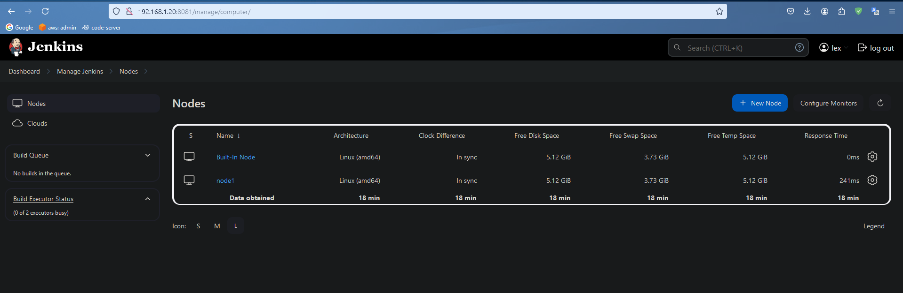
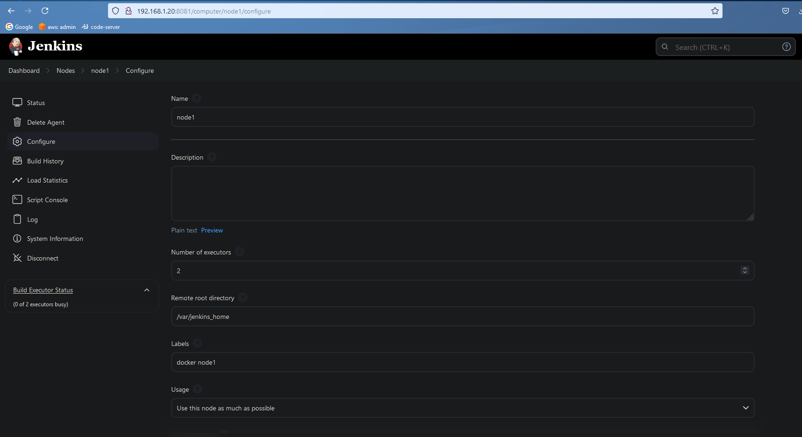
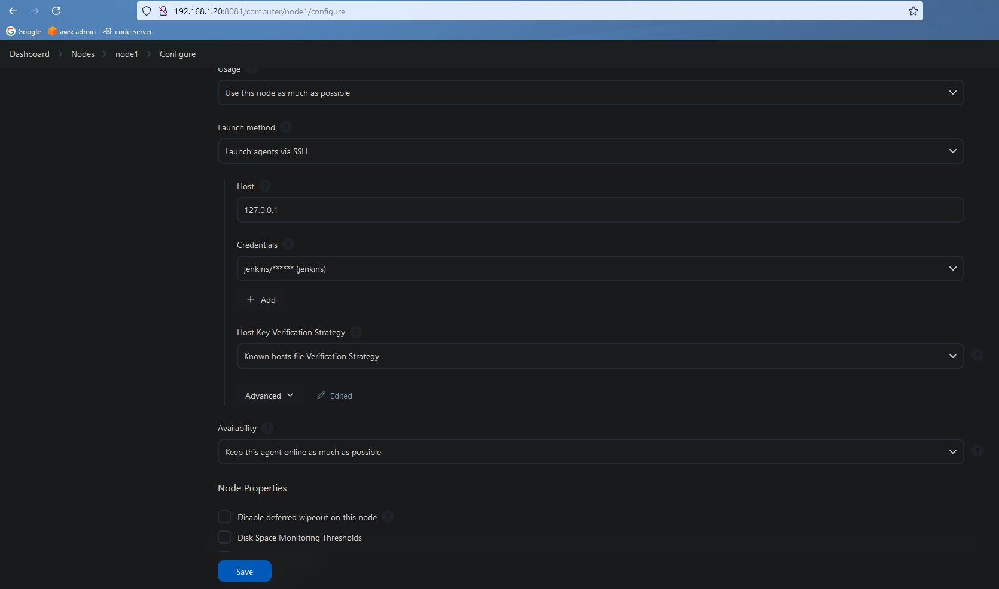
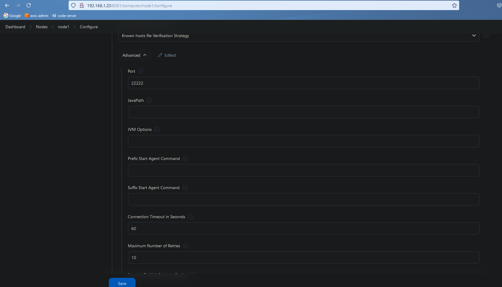
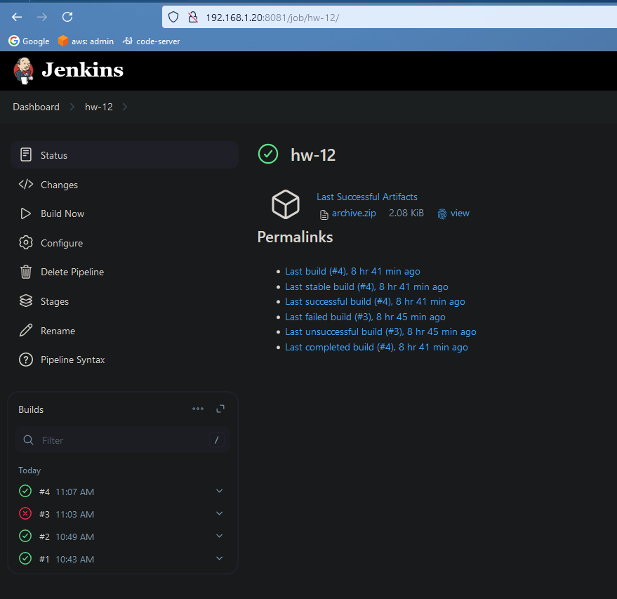
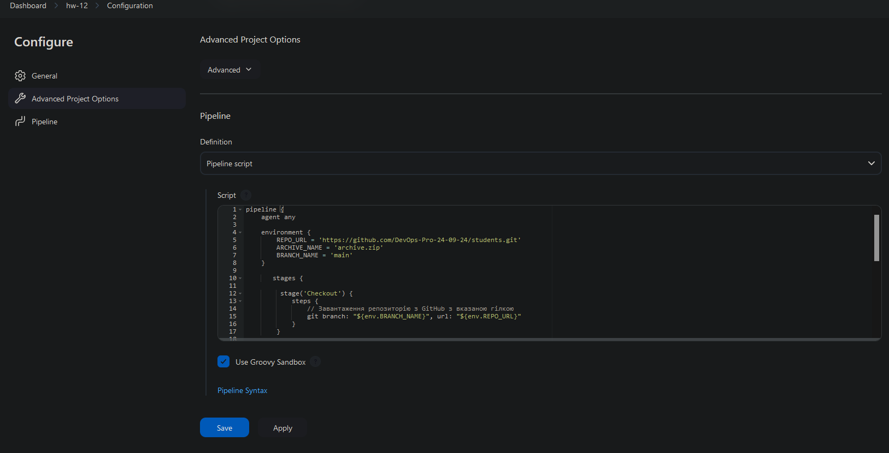
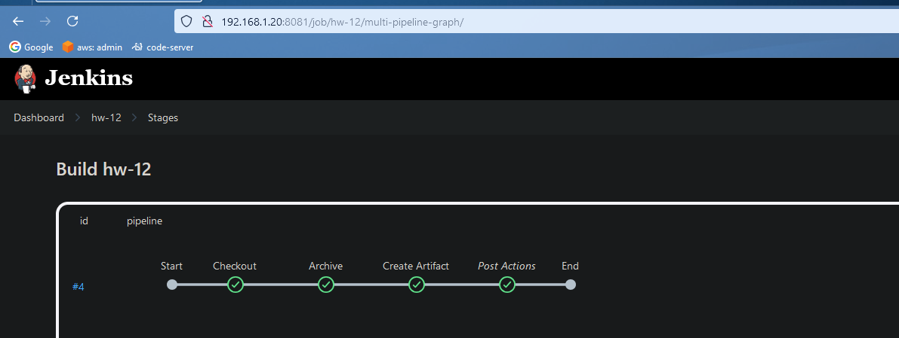

### Slave node1:




<br><br>

### Log node1:
<details>

```bash
SSHLauncher{host='127.0.0.1', port=22222, credentialsId='jenkins', jvmOptions='', javaPath='', prefixStartSlaveCmd='', suffixStartSlaveCmd='', launchTimeoutSeconds=60, maxNumRetries=10, retryWaitTime=15, sshHostKeyVerificationStrategy=hudson.plugins.sshslaves.verifiers.KnownHostsFileKeyVerificationStrategy, tcpNoDelay=true, trackCredentials=true}
[12/26/24 19:25:54] [SSH] Opening SSH connection to 127.0.0.1:22222.
Searching for 127.0.0.1 in /var/lib/jenkins/.ssh/known_hosts
Searching for 127.0.0.1:22222 in /var/lib/jenkins/.ssh/known_hosts
[12/26/24 19:25:54] [SSH] SSH host key matches key in Known Hosts file. Connection will be allowed.
[12/26/24 19:25:54] [SSH] Authentication successful.
[12/26/24 19:25:54] [SSH] The remote user's environment is:
BASH=/usr/bin/bash
BASHOPTS=checkwinsize:cmdhist:complete_fullquote:extquote:force_fignore:globasciiranges:globskipdots:hostcomplete:interactive_comments:patsub_replacement:progcomp:promptvars:sourcepath
BASH_ALIASES=()
BASH_ARGC=([0]="0")
BASH_ARGV=()
BASH_CMDS=()
BASH_EXECUTION_STRING=set
BASH_LINENO=()
BASH_LOADABLES_PATH=/usr/local/lib/bash:/usr/lib/bash:/opt/local/lib/bash:/usr/pkg/lib/bash:/opt/pkg/lib/bash:.
BASH_SOURCE=()
BASH_VERSINFO=([0]="5" [1]="2" [2]="15" [3]="1" [4]="release" [5]="x86_64-pc-linux-gnu")
BASH_VERSION='5.2.15(1)-release'
DIRSTACK=()
EUID=1000
GROUPS=()
HOME=/var/jenkins_home
HOSTNAME=6f6d28d30ee5
HOSTTYPE=x86_64
IFS=$' \t\n'
LOGNAME=jenkins
MACHTYPE=x86_64-pc-linux-gnu
MOTD_SHOWN=pam
OPTERR=1
OPTIND=1
OSTYPE=linux-gnu
PATH=/usr/local/bin:/usr/bin:/bin:/usr/games
PIPESTATUS=([0]="0")
PPID=2434
PS4='+ '
PWD=/var/jenkins_home
SHELL=/bin/bash
SHELLOPTS=braceexpand:hashall:interactive-comments
SHLVL=1
SSH_CLIENT='172.17.0.1 40180 22222'
SSH_CONNECTION='172.17.0.1 40180 172.17.0.2 22222'
TERM=dumb
UID=1000
USER=jenkins
_=']'
[12/26/24 19:25:54] [SSH] Starting sftp client.
[12/26/24 19:25:54] [SSH] Copying latest remoting.jar...
Source agent hash is 28E3A3D224EDC0F7379AD95EB0A5D4B2. Installed agent hash is 28E3A3D224EDC0F7379AD95EB0A5D4B2
Verified agent jar. No update is necessary.
Expanded the channel window size to 4MB
[12/26/24 19:25:55] [SSH] Starting agent process: cd "/var/jenkins_home" && java  -jar remoting.jar -workDir /var/jenkins_home -jar-cache /var/jenkins_home/remoting/jarCache
Dec 26, 2024 7:25:55 PM org.jenkinsci.remoting.engine.WorkDirManager initializeWorkDir
INFO: Using /var/jenkins_home/remoting as a remoting work directory
Dec 26, 2024 7:25:55 PM org.jenkinsci.remoting.engine.WorkDirManager setupLogging
INFO: Both error and output logs will be printed to /var/jenkins_home/remoting
<===[JENKINS REMOTING CAPACITY]===>channel started
Remoting version: 3261.v9c670a_4748a_9
Launcher: SSHLauncher
Communication Protocol: Standard in/out
This is a Unix agent
Agent successfully connected and online
```
</details>

<br><br>

### Pipeline hw-12:


